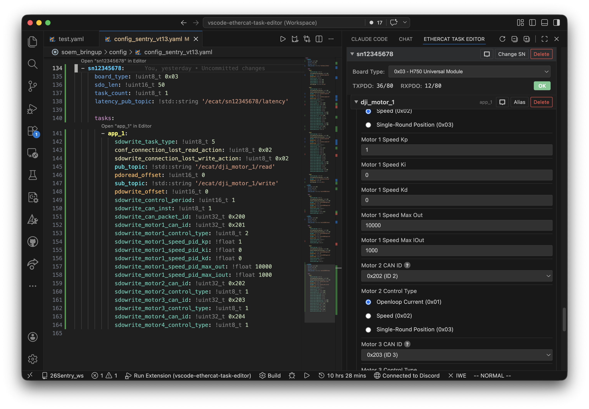

# AIMEtherCAT Task Editor

[](https://marketplace.visualstudio.com/items?itemName=HNRobert.vscode-ethercat-task-editor)
[](https://github.com/hnrobert/vscode-ethercat-task-editor)
[](LICENSE)
[](https://github.com/hnrobert/vscode-ethercat-task-editor/issues)
[](https://github.com/hnrobert/vscode-ethercat-task-editor/issues?q=is%3Aissue+is%3Aclosed)

A VS Code extension providing a visual sidebar editor for AIMEtherCAT SOEM YAML configuration files.



## Features

- **Visual slave/task editor** — Add, remove, reorder, and configure EtherCAT slaves and their tasks through a sidebar panel
- **Automatic offset calculation** — PDO read/write offsets and `sdo_len` are recalculated on every change using per-task size methods
- **Board type awareness** — Set board type per slave to get real-time PDO overflow warnings
- **Lint diagnostics** — In-editor error/warning squiggly lines for:
  - Missing or unknown `sdowrite_task_type`
  - Wrong YAML type tags (e.g. `!uint16_t` where `!uint8_t` is expected)
  - Missing or unexpected task fields
  - Offset / `sdo_len` / `task_count` mismatches
  - Conflicting or inconsistent ROS2 topic names
  - Invalid or missing type tags
- **Quick Fix actions** — One-click fixes for field issues, tag corrections, and offset recalculation directly in the YAML editor
- **Drag and drop** — Reorder tasks and slaves by dragging their headers
- **Typed YAML round-trip** — Preserves `!uint8_t`, `!int8_t`, `!uint16_t`, `!int16_t`, `!uint32_t`, `!int32_t`, `!float`, `!std::string` tags and hex formatting on save
- **Inline rename** — Rename topic segments directly in the task header without opening the YAML
- **Jump to YAML** — Click the location button on any slave or task to jump to its position in the YAML file

## Getting Started

1. Open a SOEM-format `.yaml` file in VS Code
2. The EtherCAT Config panel appears in the sidebar automatically
3. Edit task parameters in the panel — changes are written back to the YAML file immediately

## YAML Format

The extension expects YAML files with this structure:

```yaml
slaves:
  - sn_name:
      board_type: !uint8_t 0x03
      sdo_len: !uint16_t 0
      task_count: !uint8_t 0
      latency_pub_topic: !std::string "/ecat/sn_name/latency"
      tasks:
        - app_1:
            sdowrite_task_type: !uint8_t 1
            pub_topic: !std::string "/ecat/sn_name/app1/read"
            pdoread_offset: !uint16_t 0
            ...
```

## Build & Development

```bash
pnpm install
pnpm run build           # Full build (extension + webview)
pnpm run build:ext       # Extension only (tsup)
pnpm run build:webview   # Webview only (Vite)
pnpm run watch           # Watch extension
pnpm run watch:webview   # Watch webview
```

Press **F5** in VS Code to launch the Extension Development Host.

## Architecture

```bash
.
├── assets
│   └── constants
│       └── board_types.yaml
├── docs
│   └── ethercat-yaml-file-icon-setup
│       └── README.md
├── language-configuration.json
├── src
│   ├── extension.ts                      # Extension entry point
│   ├── providers
│   │   ├── EthercatCodeLensProvider.ts   # CodeLens links above tasks
│   │   ├── EthercatQuickFixProvider.ts   # Quick Fix for diagnostics
│   │   ├── EthercatYamlFormatter.ts      # YAML formatting provider
│   │   └── SoemConfigWebviewProvider.ts  # Webview panel, message handling, CRUD
│   ├── tasks
│   │   ├── TaskBase.ts                   # Base class with field/order/template logic
│   │   ├── TaskRegistry.ts               # Task type registry and lookup
│   │   ├── definitions                   # All 15 task type implementations
│   │   │   ├── index.ts                  # Exports all task definitions
│   │   │   ├── Task01_DJIRC.ts
│   │   │   ├── Task02_LkTechMotor.ts
│   │   │   ├── ...
│   │   │   └── Task15_DDMotor.ts
│   │   └── index.ts                      # Module exports
│   └── utils
│       ├── constantsParser.ts            # Board type definitions from YAML
│       ├── fieldValidator.ts             # Task type, field, offset, and tag validation
│       ├── iconConfigurator.ts           # File icon configuration
│       ├── languageDetector.ts           # EtherCAT YAML language detection
│       ├── offsetCalculator.ts           # PDO offset calculation (uses TaskRegistry)
│       ├── tagValidator.ts               # YAML type tag validation (valid tag set)
│       ├── taskTypeMemory.ts             # Persists field values across task type changes
│       ├── topicValidator.ts             # Topic name validation and diagnostics
│       ├── yamlParser.ts                 # Custom parser preserving typed tags
│       └── yamlUtils.ts                  # YAML normalization, hex format, save
├── syntaxes
│   └── ethercat-yaml.tmLanguage.json     # EtherCAT YAML syntax highlighting
├── themes
│   └── ethercat-yaml-theme.json          # EtherCAT YAML color theme
└── webview                               # Vue 3 + Vite sidebar app
    └── src
        ├── components
        │   ├── PdoStatusPanel.vue        # Global PDO overflow status
        │   ├── PropertyField.vue         # Task field editor (select/input/radio)
        │   ├── SlaveCard.vue             # Slave panel with tasks
        │   ├── SlavePdoStatus.vue        # Per-slave PDO usage + board type
        │   ├── TaskEditor.vue            # Task property editor
        │   └── TaskTypePicker.vue        # Modal for selecting task type
        ├── composables
        │   ├── useTaskFields.ts
        │   └── useVscode.ts              # VS Code webview API bridge
        └── styles                        # Modular CSS files
```

### Data flow

1. Extension parses active YAML file and sends data to webview via `postMessage`
2. Webview renders slaves/tasks with property fields
3. User edits are sent back as `updateValue` messages
4. Extension applies changes, recalculates offsets via `TaskRegistry`, and saves
5. Diagnostics are recomputed and displayed as squiggly lines in the YAML editor

### Validation pipeline

On every file change, the extension runs three validators and publishes their diagnostics:

| Validator | Checks | Diagnostic codes |
|-----------|--------|-----------------|
| `validateOffsets` | `task_count`, `pdoread_offset`, `pdowrite_offset`, `sdo_len`, missing/unknown `sdowrite_task_type`, missing/extra fields, wrong type tags | `offset-mismatch`, `field-mismatch`, `tag-mismatch` |
| `validateTags` | Missing or invalid YAML type tags | `missing-tag`, `invalid-tag` |
| `validateTopics` | Duplicate or inconsistent topic names | (none) |

## Adding a New Task Type

See [`src/tasks/README.md`](src/tasks/README.md) for the full guide on creating and registering new task types.

## License

Apache 2.0 License. See [LICENSE](LICENSE) for details.

## Acknowledgements

This VS Code extension is inspired by and builds upon the work of the following projects:

- **[TaskEditor](https://github.com/AIMEtherCAT/TaskEditor)** — The original Vue-based web app for EtherCAT module configuration and YAML generation. This extension evolved from its concept into a native VS Code sidebar editor with real-time diagnostics and quick-fix support.
- **[EcatV2_Master](https://github.com/AIMEtherCAT/EcatV2_Master)** — The EtherCAT master wrapper library (based on ROS 2 and SOEM) that consumes the YAML configuration files produced by this editor.
- **[SOEM](https://github.com/OpenEtherCATsociety/SOEM)** — Simple Open EtherCAT Master, the underlying communication library.
- **[RT-Labs](https://rt-labs.com)** — Sponsor of the AIMEtherCAT project.
